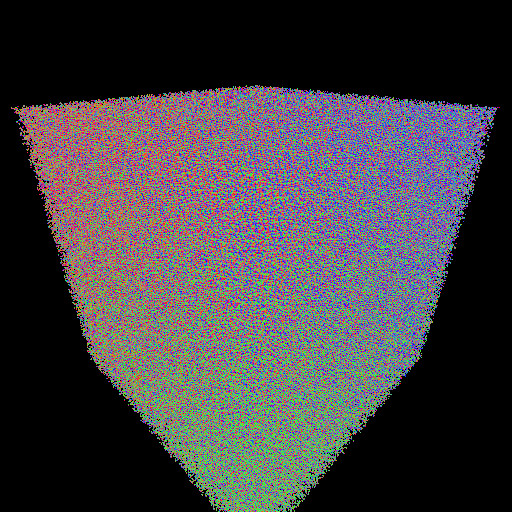

# Point-Model Minimal Distance Inquiry

Adapted from Brandon Pelfrey's Fast-BVH ray tracer.

[Fast-BVH upstream README](README.upstream.md)

### 1. Example: The cube of spheres

Ray casted Image  | Distance field
--- | --- 
Rendered by original Fast-BVH | Rendered by this adapted Fast-BVH 
standard ray traced image | color encoded distances from pixel locations to the model
 | 

### 2. Adapt Ray-Box hits to Point-Box min and max distances
```c++
// Bound squared distance from ray origin to this box.
// Lower/upper bound stored to tnear/tfar.
// Always return true.
template <typename Float>
bool BBox<Float>::intersect(const Ray<Float>& ray, Float* tnear, Float* tfar) const noexcept {
    auto const& o = ray.o;
    Vector3<Float> near, far;
    for(int i = 0; i < 3; ++i) {
        bool minlarger = min[i] > o[i];
        bool maxlarger = max[i] > o[i];
        Float o2min = fabs(min[i] - o[i]); 
        Float o2max = fabs(max[i] - o[i]); 
        far[i] = std::max(o2min, o2max);
        near[i] = (minlarger != maxlarger) ? 0.0f : std::min(o2min, o2max);
    }
    *tnear = dot(near, near);
    *tfar = dot(far, far);

    return true;
}
```

### 3. Adapt Ray-Primitive hit to Point-Primitive minimal distances
```c++
//! \brief Used for calculating the squared distance between ray orgins and spheres.
//! \tparam Float The floating point type of the spheres and rays.
template <typename Float>
class SphereIntersector final {
public:
    //! Compute squared distance between ray origin and the sphere primitive
    //! \param sphere The sphere to check intersection for.
    //! \param ray The ray whose origin is being inquired for distance to the sphere
    //! \return An instance of @ref FastBVH::Intersection that contains the distance
    //! data.
    Intersection<Float, Sphere<Float>> operator()(const Sphere<Float>& sphere, const Ray<Float>& ray) const noexcept {
        auto oc = length(sphere.center - ray.o);
        auto os = fabs(oc - sphere.r);

        return Intersection<Float, Sphere<Float>>{os*os, &sphere};
    }
};
```
